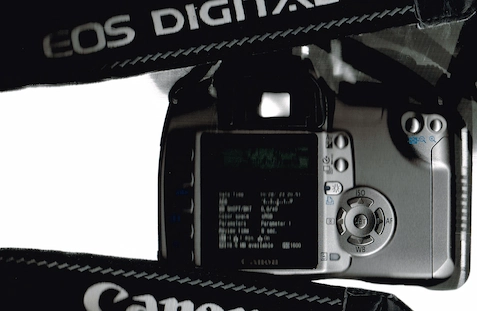
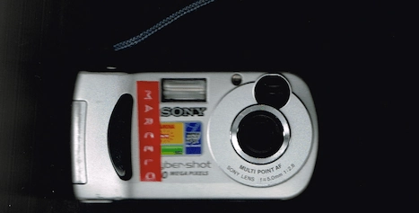
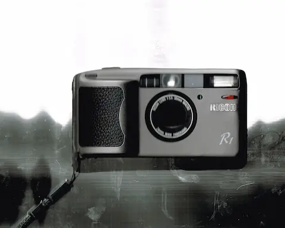
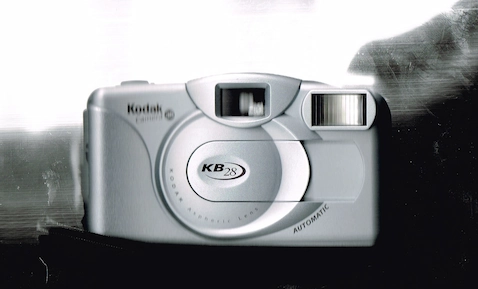
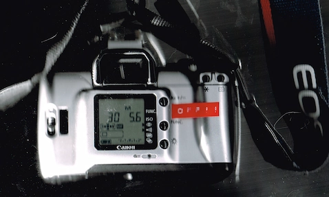

[Gear Aquisition Syndrome](https://en.wikipedia.org/wiki/Shopping_addiction#Gear_acquisition_syndrome_(G.A.S.)) is a terrible, terrible thing. I think I have too many cameras, given how little pictures I actually take with any of them. These are a mix of old, modern, film, digital, bought, used, etc. 

## Digital

### Canon Digital Rebel XT

Even though it is almost 18 years old (!) this is still, technically, the "best camera" I own. I don't have the money to afford a new mirrorless or even a relatively-new DSLR - so much so that I can't even afford what this camera goes for on eBay, _i got it for free from a family member_. 

### Sony Cybershot DSC-P31

### Samsung Galaxy S20 5G

This one is low hanging fruit. 

## Film

### Ricoh R1 35mm

This, I think, is probably the second best film  point-and-shoot that money can buy...the first being the better version of this, the Ricoh R1S with more manual control. This thing is absurdly light and has a sharp lens. 

These were made in the ~late 80s, and as a result, many are falling apart. One of the first things that will fail is small LCD screen on the top which displays how much film is left in the roll. While I didn't get that problem, the problem that I recieved is that the shutter board completely failed on me after my [London]({{ relref "/gallery/london" }}) trip. 

### Kodak KB28

This is my "party" or "quick action" camera. It is made of plastic, with a plastic lens, a fixed aperature, and fixed shutter speed. It has no autofocus, which was actually what I was looking for.

With the Ricoh, if I need to take a click-it-or-you-might-miss-it moment, I need to press the tiny red power button, half-press the shutter to grab focus and decide if it wants flash or not, then wait another ~700ms so that the lens can retract, fire the shutter, and retract again. Sometimes it's too fucking cumbersome

With the KB28, I just whip it out, slide the lens cover to turn it on, press the shutter and thats it. It's almost instantaneous since you don't wait for a light meter or any focus activity. The flash *always* fires whether you like it or not, which means that you don't need to think about it.

### Canon EOS 300V (Rebel XTi)

This is just the film version of my Digital Rebel XT.

### Polaroid Instax
